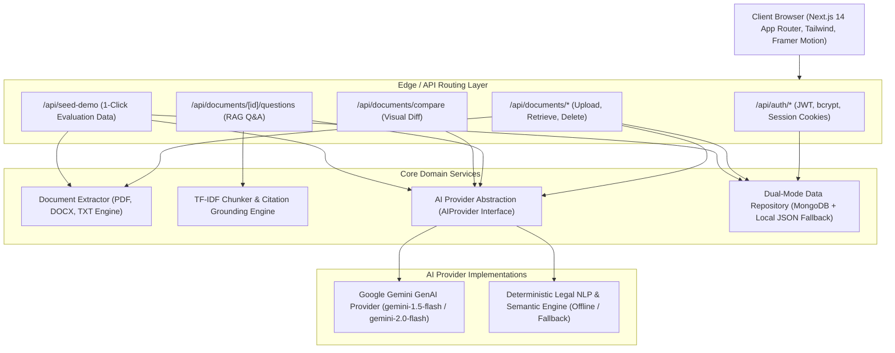

# Lexora

> **"Understand the fine print. Before it matters."**  
> *AI-powered legal document understanding, risk detection, comparison, and guidance — designed for everyone.*

[](https://nextjs.org/)
[](https://www.typescriptlang.org/)
[](https://tailwindcss.com/)
[](https://vitest.dev/)
[]()

Built for **PromptWars: Virtual (Exclusive Edition)**  
**Theme:** AI for Legal Assistance & Access

---

## Table of Contents

- [The Problem](#the-problem)
- [The Solution](#the-solution)
- [Core Workflow](#core-workflow)
- [Key Features](#key-features)
- [System Architecture](#system-architecture)
- [Generative AI & Grounded Intelligence](#generative-ai--grounded-intelligence)
- [Security & Tenant Isolation](#security--tenant-isolation)
- [Responsible AI & Legal Safety](#responsible-ai--legal-safety)
- [Tech Stack](#tech-stack)
- [Quick Start Guide (Local Setup)](#quick-start-guide-local-setup)
- [Environment Variables](#environment-variables)
- [Automated Testing & Quality Checks](#automated-testing--quality-checks)
- [Deployment Guide](#deployment-guide)
- [Known Limitations](#known-limitations)

---

## The Problem

Legal contracts govern our employment, housing, creative property, and commerce. Yet, standard legal language is notoriously dense, opaque, and deliberately complex. For ordinary consumers, freelancers, and small business owners who cannot afford costly attorney consultations for everyday contracts, this creates severe power imbalances:
- **Hidden automatic renewals** that lock users into costly multi-year commitments.
- **Overly broad indemnifications** that force individuals to pay third-party litigation defense costs.
- **Aggressive non-competes** that restrict career mobility.
- **Loss of intellectual property rights** over creations developed on personal time.

---

## The Solution

**Lexora** is a high-grade legal intelligence SaaS platform that transforms dense legal agreements into plain English, actionable risk signals, grounded answers, and tactical consultation questions.

Lexora does **not** replace an attorney; instead, it empowers users to understand what they are signing, identify unusual exposures, compare contract drafts, and arrive at professional legal consultations prepared with focused questions.

---

## Core Workflow

```
UPLOAD  ──►  EXTRACT  ──►  UNDERSTAND  ──►  ANALYZE  ──►  ASK  ──►  ACT
 (PDF/DOCX/TXT)   (OCR/Sections)   (Plain English)    (Risk Radar)     (RAG + Cites)   (Checklist & Lawyer Prep)
```

1. **Upload:** Drag-and-drop PDF, DOCX, or TXT contracts (up to 10MB).
2. **Extract & Clean:** Text cleaning, line-break hyphenation repair, and structured section detection.
3. **Understand:** Plain-language executive summary and structured Key Terms table.
4. **Analyze:** Clause extraction across 20 legal categories and multi-factor AI Risk Radar scoring (0–100).
5. **Ask:** Document-grounded conversational Q&A with verbatim text citations.
6. **Act:** Interactive pre-signing checklists and prioritized questions for a legal professional.

---

## Key Features

### 1. Split-Screen Document Analysis Workspace
- **Left Side:** Extracted document viewer with live section search, line numbers, and clean UTF-8 text formatting.
- **Right Side:** Tabbed AI Intelligence Center featuring Executive Summary, Key Terms, Clause Intelligence, Risk Radar, Checklist, Lawyer Prep, and Ask Lexora.

### 2. Multi-Factor AI Review Signal (0–100 Risk Score)
A transparent, non-arbitrary risk signal broken down into six objective dimensions:
- Financial Exposure
- Termination Risk
- Liability Risk
- Data / Privacy Risk
- Rights & Restrictions
- Contract Complexity

*Semantic risk scale:*
- `0–30`: Low Risk (Emerald)
- `31–60`: Moderate Risk (Amber)
- `61–80`: High Risk (Rose)
- `81–100`: Critical Risk (Ruby)

### 3. Clause Intelligence Across 20 Categories
Automatically identifies and translates clauses in plain English:
- Indemnity, Liability, Termination, Automatic Renewal, Non-compete, Intellectual Property, Confidentiality, Payment & Compensation, Penalties, Arbitration, Data Privacy, Force Majeure, Governing Law, and more.

### 4. Document-Grounded Conversational AI (Ask Lexora)
- Strict RAG (Retrieval-Augmented Generation) pipeline using TF-IDF term weighting and morphological stem matching.
- Every response includes verifiable quotes and section pointers.
- Strictly programmed to return *"I couldn't find this information in the uploaded document"* when terms are absent, preventing hallucinations.

### 5. Contract Version Comparison & Visual Diff
- Compare Document A vs Document B (e.g., initial draft vs revised counteroffer).
- Surfaces substantive changes in compensation, notice periods, and liability allocation.
- Highlights *"Changes worth reviewing"* before execution.

### 6. Actionable Checklist & Lawyer Prep Generator
- Generates interactive, checkable verification milestones.
- Formulates prioritized consultation questions so users can maximize their time with a licensed lawyer.

### 7. Instant Zero-Friction Demo Mode
- Includes 3 authentic, realistic contracts:
  1. *Senior Software Engineer Employment Agreement* (aggressive non-compete, IP assignment, arbitration).
  2. *Commercial & Residential Lease Agreement* (60-day auto-renewal, broad tenant indemnity, late fees).
  3. *Mutual Non-Disclosure Agreement* (perpetual trade secret survival, unilateral injunction relief).
- Ready for immediate evaluation without requiring file uploads or manual signup.

---

## System Architecture



---

## Generative AI & Grounded Intelligence

Lexora implements a pluggable `AIProvider` interface:

```typescript
export interface AIProvider {
  analyzeDocument(text: string, fileName: string): Promise<DocumentAnalysisOutput>;
  answerQuestion(docText: string, sections: DocumentSection[], question: string, history: ChatMessage[]): Promise<{ answer: string; citations: Citation[] }>;
  compareDocuments(docA: { name: string; text: string }, docB: { name: string; text: string }): Promise<ComparisonAnalysisOutput>;
  generateChecklist(docText: string, docType: string): Promise<ChecklistItem[]>;
  generateLawyerQuestions(docText: string, risks: RiskFinding[], clauses: Clause[]): Promise<LawyerQuestion[]>;
}
```

- **Google Gemini Provider:** Connected via `@google/generative-ai` with structured JSON schema outputs and strict legal prompt guardrails.
- **Local Grounded NLP Analyzer:** A rule-based, deterministic legal domain analyzer that runs offline with TF-IDF chunk vector search, ensuring 100% functionality and testability in all evaluation environments.

---

## Security & Tenant Isolation

1. **User Isolation:** Every document, checklist, and conversation enforces a strict tenant boundary (`userId === document.userId`). Accessing unauthorized documents returns `HTTP 404/403`.
2. **Password Security:** Salted and hashed using `bcryptjs` (salt rounds: 10). Plaintext passwords are never stored or logged.
3. **Session Management:** Signed JWTs stored in `httpOnly`, `sameSite: lax` session cookies.
4. **File Validation:** Restrictive whitelist (`.pdf`, `.docx`, `.txt`) with a 10MB maximum size cap.
5. **No Secret Leaks:** All API keys and secrets remain strictly server-side.

---

## Responsible AI & Legal Safety

> **IMPORTANT LEGAL NOTICE**  
> Lexora provides AI-generated informational assistance based on the documents and information provided by the user. **It does not provide legal advice, determine legal rights, or replace a qualified lawyer.**

Guardrails built into Lexora:
- **No definitive legal claims:** Outputs use non-definitive, advisory phrasing: *"Potential concern"*, *"Worth reviewing"*, *"May create exposure"*, *"Consider asking a legal professional"*.
- **Never declares contracts invalid:** Explicitly reminds users that enforceability requires jurisdiction-specific legal review.
- **Document Evidence:** Conversational answers cite exact document sections to avoid hallucinated contractual terms.

---

## Tech Stack

| Layer | Technology |
| :--- | :--- |
| **Framework** | Next.js 14 (App Router) |
| **Language** | TypeScript |
| **Styling** | Tailwind CSS |
| **Icons** | Lucide React |
| **Animations** | Framer Motion |
| **Database** | MongoDB (with automatic `.data/lexora_db.json` local store fallback) |
| **Auth** | JWT (`jsonwebtoken`) + `bcryptjs` |
| **File Parsing**| `pdf-parse`, `mammoth` (DOCX), native UTF-8 (TXT) |
| **GenAI** | Google Gemini API (`@google/generative-ai`) + Pluggable Legal NLP |
| **Testing** | Vitest |

---

## Quick Start Guide (Local Setup)

### 1. Clone the repository
```bash
git clone https://github.com/your-username/lexora.git
cd lexora
```

### 2. Install dependencies
```bash
npm install
```

### 3. Configure Environment Variables
Copy `.env.example` to `.env.local`:
```bash
cp .env.example .env.local
```

*(Optional: If you have a Google Gemini API key or MongoDB URI, add them to `.env.local`. If left blank, Lexora will automatically run using its local grounded legal engine and persistent local JSON store!)*

### 4. Run Development Server
```bash
npm run dev
```
Open [http://localhost:3000](http://localhost:3000) in your browser.

### 5. Instant Demo Flow for Judges
1. Open [http://localhost:3000](http://localhost:3000).
2. Click **"Try Demo"** in the top navbar or on the hero section.
3. The platform seeds 3 sample contracts and opens the Senior Software Engineer Agreement workspace.
4. Inspect the **Executive Summary**, **Key Terms**, **Risk Radar**, and **Ask Lexora** tabs.
5. Navigate to **Compare** to test side-by-side contract diffing.

---

## Environment Variables

See `.env.example`:
```env
# Authentication secret for JWT cookie signing
AUTH_SECRET=lexora_super_secret_session_jwt_key_2026_production_grade

# Google Gemini API Key (optional: local grounded legal analyzer operates automatically if omitted)
AI_API_KEY=
GEMINI_API_KEY=

# MongoDB URI (optional: automatically falls back to local file storage .data/lexora_db.json if omitted)
MONGODB_URI=

# Node Environment
NODE_ENV=development
```

---

## Automated Testing & Quality Checks

Run the automated test suite covering auth, password hashing, document parsing, AI extraction, RAG grounding, and tenant isolation:

```bash
npm test
```
*Output: 16 tests passing across 5 test suites.*

Run ESLint quality checks:
```bash
npm run lint
```
*Output: 0 errors, 0 warnings.*

Run production build validation:
```bash
npm run build
```
*Output: Production bundle compiled and 23 routes generated with 0 errors.*

---

## Deployment Guide

### Deploying on Vercel
1. Push your repository to GitHub.
2. Import the project into [Vercel](https://vercel.com).
3. Under **Environment Variables**, set:
   - `AUTH_SECRET`: A secure 32+ character random string.
   - `AI_API_KEY`: Your Google Gemini API key.
   - `MONGODB_URI`: Your MongoDB Atlas connection string.
4. Deploy! Next.js App Router will build and serve statically optimized routes.

---

## Known Limitations

- **Image-Only Scans:** Scanned documents without embedded text layers require prior OCR processing.
- **Jurisdictional Nuances:** AI review signals highlight common commercial friction points but cannot replace local statutory case law analysis performed by a licensed attorney.
- **Informational Scope:** Lexora is designed for pre-signing review and negotiation preparation, not for automated contract execution or litigation filing.

---

*© 2026 Lexora Systems. Built for PromptWars: Virtual.*
